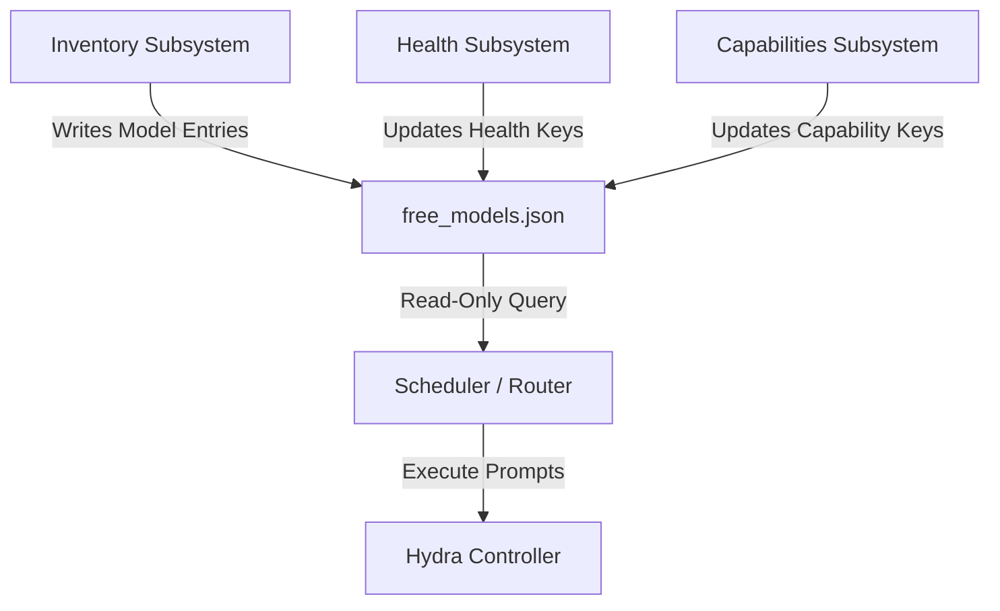

# Hydra Architecture Specification

This document defines the core architecture, subsystem boundaries, data ownership contracts, and directory layout for **Hydra Brain**.

---

## 1. Architectural Philosophy

Hydra is designed around the principle of **AI provider and model resilience**. The core rule is:
> A failed AI model or provider must not stop the system.

To scale this resilience cleanly, Hydra divides its operations into two distinct domains:
1. **Knowledge about Models:** Discovering what models exist, measuring how they behave, and validating what tasks they can execute.
2. **Using Models:** Selecting a model, routing requests, and managing fallback behaviors.

These domains are separated by a **Normalized Registry** file that serves as the single source of truth for the entire platform.

---

## 2. Subsystem Directory Map

The Hydra codebase is organized into independent, loosely-coupled modules:

```text
hydra-brain/
│
├── registry/                 # Persistent model catalog storage (Single Source of Truth)
│   ├── free_models.json      # Envelope-wrapped free models directory
│   ├── free_models.csv       # Excel-compatible spreadsheet copy
│   └── free_models_grouped.json # Grouped by provider for fast scheduling lookups
│
├── inventory/                # Standalone Inventory Subsystem (FROZEN v1.0)
│   ├── sync_openrouter.py    # Discovers models and populates the registry
│   ├── compare_inventory.py  # Compares catalog snapshots for additions/removals
│   └── validate_inventory.py # Asserts schema integrity and unique constraints
│
├── health/                   # Standalone Health Monitor Subsystem (v0.1 Proposed)
│   └── monitor.py            # Periodically tests availability and latencies
│
├── capabilities/             # Standalone Capability Scanner (Future)
│   └── scanner.py            # Runs tests to determine coding/reasoning capabilities
│
├── core/                     # Hydra Runtime core engine
│   ├── hydra.py              # Main controller class
│   ├── router.py             # Selection and cooldown router
│   ├── registry.py           # Legacy model loader (integrates with registry API)
│   └── state.py              # Active failure state and cooldown manager
│
├── reports/                  # Automated markdown reports (GitHub commit friendly)
│   ├── Inventory_Report.md   # Active catalog status report
│   └── Diff_Report.md        # Snapshot delta report
│
├── docs/                     # Specifications and architectural documentation
│   ├── registry_schema.md    # Schema definition for free_models.json
│   └── architecture.md       # [This document] System architecture specification
│
└── main.py                   # User CLI entry point (python main.py discover / prompts)
```

---

## 3. Subsystem Boundaries and Roles



### A. Inventory Subsystem (Status: FROZEN v1.0)
* **Role:** Discovers models and serializes the core catalog registry.
* **Responsibilities:** Fetches upstream APIs, filters free offerings, determines provider names/display names, generates deterministic hex stable IDs (`hydra-or-xxxxxxxx`), and initializes placeholders.
* **Network Access:** Yes (communicates with external endpoint catalogs).

### B. Health Monitor Subsystem (Status: Proposed v0.1)
* **Role:** Evaluates execution reliability and latency of registry models.
* **Responsibilities:** Performs lightweight model pings, measures response times, tracks success/failure rates, captures provider error codes, and updates the `health` subkey.
* **Network Access:** Yes (invokes individual models directly).

### C. Capability Scanner Subsystem (Status: Future)
* **Role:** Validates capabilities (JSON output, reasoning, coding, tool use) using standardized probe queries.
* **Responsibilities:** Scores responses, classifies performance grades, and updates the `capabilities` subkey.
* **Network Access:** Yes (invokes individual models directly).

### D. Scheduler & Router Subsystem (Status: Runtime Core)
* **Role:** Selects the best head and fallback models for a user prompt.
* **Responsibilities:** Queries the registry via the registry API to identify healthy, capable candidates, evaluates priorities and failure cooldowns, and routes queries.
* **Network Access:** No (independent of external catalog discovery; works strictly offline on the registry file).

---

## 4. Data Ownership & Access Contract

To prevent tight coupling, subsystems must strictly adhere to this file access policy:

| File / Component | Inventory Sync | Health Monitor | Capability Scanner | Scheduler / Router |
| :--- | :--- | :--- | :--- | :--- |
| `registry/free_models.json` | **Read/Write** (Full Schema) | **Read/Write** (Only `"health"` subkey) | **Read/Write** (Only `"capabilities"` subkey) | **Read-Only** |
| `registry/openrouter_models_raw.json` | **Write-Only** | No Access | No Access | No Access |
| `registry/free_models.csv` | **Write-Only** | No Access | No Access | No Access |
| `reports/Diff_Report.md` | **Write-Only** | No Access | No Access | No Access |
| `state/hydra_state.json` | No Access | No Access | No Access | **Read/Write** (Active runtime failures) |

---

## 5. Information Flow

1. **Discovery Loop (Scheduled / Standalone):**
   `sync_openrouter.py` runs -> fetches catalogs -> writes `registry/free_models.json`.
2. **Health Loop (Periodic Daemon):**
   `health/monitor.py` runs -> queries registry models -> pings endpoints -> updates model `"health"` keys in place.
3. **Execution Loop (On-Demand):**
   User submits prompt -> Scheduler loads `registry/free_models.json` -> filters candidate models matching task capabilities -> bypasses models marked "degraded" or "unavailable" by the Health Monitor -> selects model -> executes prompt -> updates local runtime cooldowns in `hydra_state.json` on execution failures.
